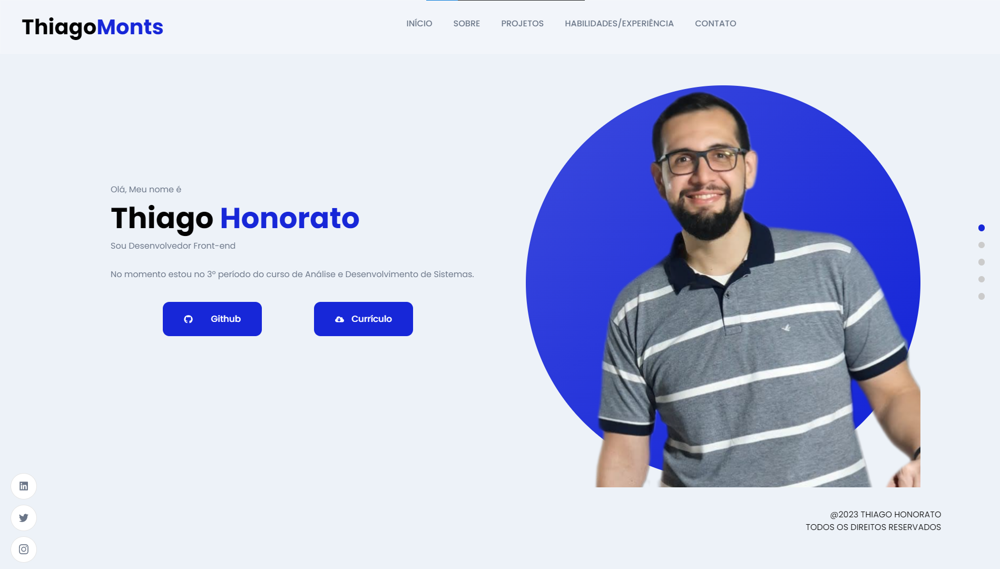

<h1 align="center"> Portfólio </h1>

Projeto desenvolvido em React, com o intuito de apresentar meu portfólio.

  <a href="#-tecnologias">🚀 Tecnologias</a>&nbsp;&nbsp;&nbsp;|&nbsp;&nbsp;&nbsp;
  <a href="#-projeto">💻 Projeto</a>&nbsp;&nbsp;&nbsp;|&nbsp;&nbsp;&nbsp;
  <a href="#-layout">🔖 Layout</a>&nbsp;&nbsp;&nbsp;|&nbsp;&nbsp;&nbsp;
  <a href="#memo-licença">📝 Licença</a>

 

  

## 🚀 Tecnologias

Esse projeto foi desenvolvido com as seguintes tecnologias:

- [NodeJS](https://nodejs.org/)
- [ReactJS](https://reactjs.org/)
- [Sanity](https://www.sanity.io/)

 

## 💻 Projeto

Este, sem sombra de dúvidas, foi projeto que mais me motivei a desenvolver, pois além de ser um trabalho pessoal, tem a finalidade de mostrar um pouco das minhas habilidades e competências que serão minha porta de entrada para as oportunidades que irão surgir. O Front-end do projeto foi desenvolvido utilizando o framework React, assegurando os benefícios da tecnologia, permitindo que o código seja mais objetivo, reutilizando os componentes comums, garantindo assim um alto desempenho e o Back-end foi criado a partir da ferramenta Sanity, que facilitou bastante no desenvolvimento, os schemas criados foram uma excelente ponte entre o front-end e o back-end. No que diz respeito a parte de estilização, utilizei o SCSS, que além de ser bastante objetivo, traz uma grande praticidade e estabilidade.

 

## 🔖 Layout

Você pode acessar o site através [DESSE LINK](https://thiagohonorato.netlify.app/).

 

## 📝 Licença

Esse projeto está sob a licença MIT.

---

Desenvolvido por [Thiago Honorato](https://www.linkedin.com/in/honoratothiago/)
